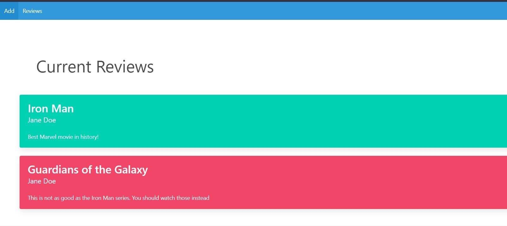
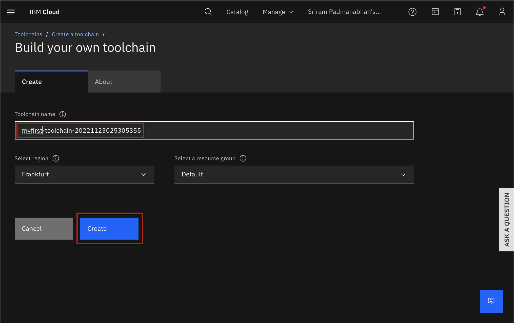

# Movies Review Database DevOps Pipelines
This web application allows users to review movies, and then sorts the reviews into color categories, depending on their general tone. You can deploy it on IBM Cloud and enable CI/CD on Code Engine to ensure any changes made in the future will be deployed to the application.

**Watson Natural Language Understanding** offers a suite of features for text analysis. The Watson Natural Language Understanding analyze text to extract metadata from content such as concepts, entities, keywords, categories, sentiment, emotion, relations, and semantic roles using natural language understanding.

## How it works
1. User can submit movies

<p align="center">
  
</p>  

2. User is shown review page with review of the movies (with all negative and positive categories). Database was created and movies are inserted into Cloudant
<p align="center">
  
</p>    

## Pre-requisites: Sign up for IBM Cloud account, create a Watson Natural language Understanding, and a Cloudant service
1. Create an IBM cloud account if you don't have one already.

2. Create an instance of Natural Language Understanding service.
Log into you IBM cloud account with your credentials. Go to the [Catalog](https://cloud.ibm.com/catalog?utm_medium=Exinfluencer&utm_source=Exinfluencer&utm_content=000026UJ&utm_term=10006555&utm_id=NA-SkillsNetwork-wwwcourseraorg-SkillsNetworkCoursesIBMDeveloperSkillsNetworkCD0220ENSkillsNetwork20363180-2022-01-01) page, click on the **Services** , select the **AI/ Machine learning** category and then select the **Natural Language Understanding** resource.
<p align="center">
  
</p>    

On the **Natural Language Understanding** page, select the area closest to you as the **Region**, verify that the **Lite** plan is selected, and then click **Create**. You can keep the default name if you want.
<p align="center">
  
</p>    

To create a **Cloudant** service. Go to IBM Cloud Navigation menu and select the **Cloud Foundry**. Choose **Node.js** as your application runtime. Select the area closest to you as the **Region** and then click **Create**. You can keep the default name if you want. Now you should see both NLU and Cloudant services active on the resource list

<p align="center">
  
</p>  

## DevOps development
### Fork the Git repository to have the server and client code you need to start
<details><summary><b>Show instructions</b></summary>

Create a fork of this [repository](https://github.com/Vykp00/qkfls-Movie-Reviews-Database.git) into your own. Clone the repository by pasting the url you copied from the git repository:
```sh
  git clone https://github.com/Vykp00/qkfls-Movie-Reviews-Database.git
```
</details>

### Create CI/CD pipeline
#### Create a tool chain
<details><summary><b>Show instructions</b></summary>

1. Go to [IBM Cloud](https://cloud.ibm.com) and log into your IBM cloud account.

2. Click the burger menu on top left. 

<p align="center">
  
</p>  

3. Choose DevOps->Toolchain from the menu that drops down.

<p align="center">
  
</p>  

4. Click **Create toolchain** to start creating one.

<p align="center">
  
</p>  

5. In the search bar type `Build your own` and choose the option that comes up as shown in the image below.

<p align="center">
  
</p> 

6. Give a name to the toolchain that you are creating and click **Create**. The toolchain gets created in a few seconds. Once the tool chain is created you can add the repositories, delivery pipeline and IBM Cloud tools.

<p align="center">
  
</p> 

7. In your toolchain dashboard, click **Add** to add the repository.

<p align="center">
  
</p> 

8. In the search bar, type Github to source from GitHub repo. You will need to authorize your IBM Cloud account to use youe github repo, when you do this the first time.

9. Configure the github by choosing to **Fork** from your repository and then click **Create Integration** for it to get started.

<p align="center">
  
</p> 

</details>

#### Create Delivery Pipeline
<details><summary><b>Show instructions</b></summary>

1. Click **Add** to add a delivery pipeline.

2. In the search bar, look for **Delivery pipeline** and choose the option that gets listed as shown in the image below.

<p align="center">
  
</p> 

3. Give an appropriate name to the delivery pipeline.

<p align="center">
  
</p> 

4. Setup build stage and deploy stage. The repository configured should be the input for build stage and the build stage should be the input for the deploy stage. Click on the **Delivery pipeline** you just added.

5. Add a stage to the delivery pipeline. Click on **Add Stage**.

6. The Input panel automatically populates with the Github repository you have chosen, pointing to the main branch. Choose the option to **Run jobs automatically for Git events on the chosen branch**. This will ensure that everytime some changes are committed to the Git repository, the pipeline is automatically triggered.

<p align="center">
  
</p> 

7. Click on the **Job** panel. Click the **+** to add a job and choose **Build** from the list of jobs. You can opt for a simple build job which will build the Dockerfile in the root of your repository. 

8. Click** Save to save the job in the stage you just added. This will bring you back to the toolchain home page showing the stage you just added.

<p align="center">
  
</p> 

9. Now add the Deploy stage. But this time, the input is the build stage. Remember to input your API key for Cloudant service

10. Now click **Run**. It will take about 5 minutes to complete.

<p align="center">
  
</p> 

11. Now head to NLU and your Cloudant services. Go to **Conection** and connect to your application. Follow its instruction and your website should work normally.
</details>